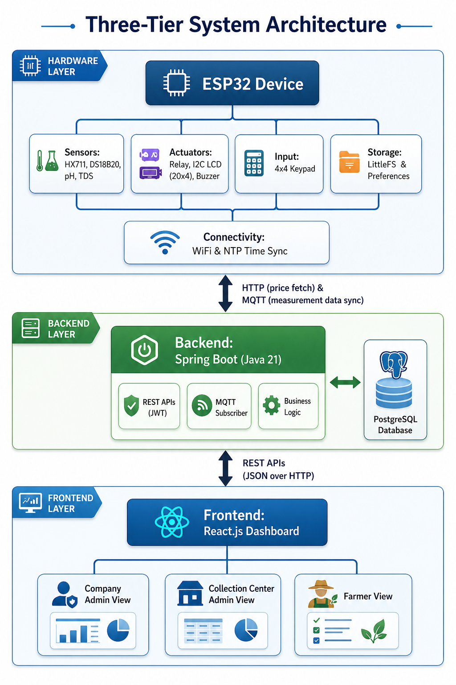
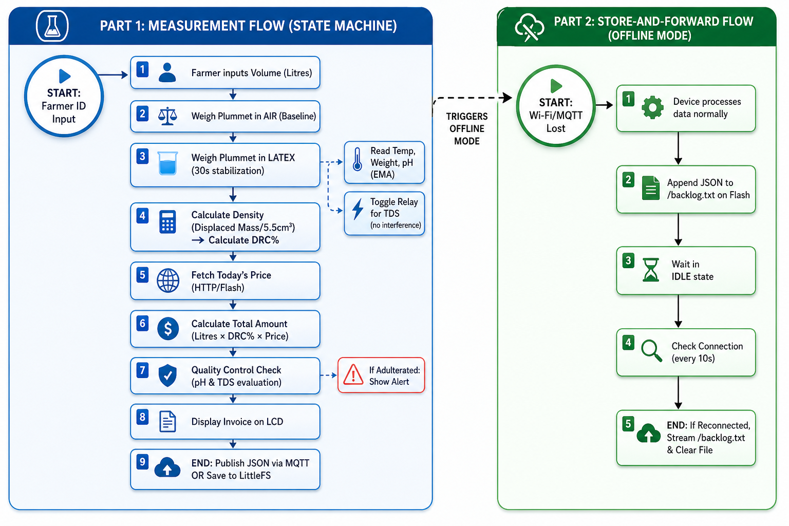

# Smart-Metrolac 🌿
### IoT-Based Rubber Latex Quality Measurement System

> **3rd Year Engineering Project · Group 16 · Department of Computer Engineering · University of Peradeniya**

[](.)
[](.)
[](.)
[](.)
[](.)

---

## 📌 Table of Contents

- [Problem Statement](#-problem-statement)
- [Our Solution](#-our-solution)
- [System Architecture](#-system-architecture)
- [Data & Control Flow](#-data--control-flow)
- [What Is Measured](#-what-is-measured)
- [Sensors & Actuators](#-sensors--actuators)
- [Tech Stack](#-tech-stack)
- [Functional Requirements](#-functional-requirements)
- [Non-Functional Requirements](#-non-functional-requirements)
- [Current Progress](#-current-progress)
- [The Team](#-the-team)

---

## 🚨 Problem Statement

Sri Lanka's natural rubber industry depends on a **decades-old manual measurement process**:

- Farmers bring latex to collection centers where readings are taken manually
- Calculations are done by hand — with **pen and paper**, and no digital records
- The process is error-prone, **open to fraud**, and non-transparent
- Farmers have **no visibility** into how their payments are calculated
- Salt adulteration and ammonia addition are common, undetected fraud vectors

---

## 💡 Our Solution

**Smart-Metrolac** replaces the manual process with an **ESP32-based IoT device** that:

- Automatically measures **DRC (Dry Rubber Content)**, temperature, pH, and TDS
- Sends data wirelessly to a **Spring Boot backend** via MQTT
- Generates **digital invoices** and weekly payment summaries automatically
- Provides a **React.js web dashboard** for farmers, collection center admins, and company admins
- Operates **fully offline** with a Store-and-Forward backlog system

---

## 🏗️ System Architecture

Three-tier architecture connecting edge hardware to a cloud-backed web dashboard.

<p align="center">
    
</p>

```
┌─────────────────────────────────────────────────────────────┐
│  HARDWARE LAYER                                             │
│  ESP32 Device                                               │
│  ├── Sensors:    HX711, DS18B20, pH, TDS                   │
│  ├── Actuators:  Relay, I2C LCD (20x4), Buzzer             │
│  ├── Input:      4×4 Keypad                                 │
│  └── Storage:    LittleFS (backlog) + Preferences (cache)  │
└───────────────────────┬─────────────────────────────────────┘
                        │  HTTP (price fetch) + MQTT (telemetry)
┌───────────────────────▼─────────────────────────────────────┐
│  BACKEND LAYER                                              │
│  Spring Boot (Java 21)                                      │
│  ├── REST APIs (JWT secured)                                │
│  ├── MQTT Subscriber                                        │
│  ├── Business Logic (payments, alerts)                      │
│  └── PostgreSQL Database (9 tables)                        │
└───────────────────────┬─────────────────────────────────────┘
                        │  REST APIs (JSON over HTTP)
┌───────────────────────▼─────────────────────────────────────┐
│  FRONTEND LAYER                                             │
│  React.js Dashboard                                         │
│  ├── Company Admin View                                     │
│  ├── Collection Center Admin View                           │
│  └── Farmer View                                           │
└─────────────────────────────────────────────────────────────┘
```

---

## 🔄 Data & Control Flow

Complete measurement cycle and offline resilience flow.

<p align="center">
    
</p>

### Measurement Flow (State Machine)

| Step | Action | Detail |
|------|--------|--------|
| 1 | Farmer ID Input | 4-digit ID via keypad |
| 2 | Volume Input | Farmer enters litres |
| 3 | Air Baseline | Weigh plummet in open air (differential baseline) |
| 4 | 30s Stabilization | Plummet in latex — reads Temp, Weight, pH via EMA; relay pulses TDS |
| 5 | DRC Calculation | Displaced Mass ÷ 5.5 cm³ → Density → DRC% (temperature-compensated) |
| 6 | Price Fetch | HTTP GET to backend; falls back to Preferences cache if offline |
| 7 | Invoice Calculation | Total = Litres × DRC% × Price |
| 8 | QC Alert | pH & TDS checked against thresholds; alert shown if adulterated |
| 9 | Display Invoice | Invoice shown on 20×4 LCD |
| 10 | Publish or Save | MQTT publish if online → LittleFS `/backlog.txt` if offline |

### Store-and-Forward Flow (Offline Mode)

```
Wi-Fi Lost
    │
    ▼
Device completes measurement normally (uses cached price)
    │
    ▼
Append JSON payload → /backlog.txt (LittleFS)
    │
    ▼
Return to IDLE state
    │
    ▼
Background timer checks connection every 10 seconds
    │
    ▼
Reconnected → Stream /backlog.txt to backend → Clear file
```

---

## 📐 What Is Measured

| Parameter | Sensor | Purpose |
|-----------|--------|---------|
| **Weight** | HX711 Load Cell | Differential mass (air vs. latex) to compute density |
| **Temperature** | DS18B20 | DRC & TDS temperature compensation |
| **pH** | Analog pH Sensor | Detect spoilage (< 6.0) or ammonia addition (> 8.0) |
| **TDS** | Analog TDS Sensor | Detect salt adulteration (> 500 ppm) |
| **DRC%** | Calculated | Derived from displaced mass, density & temperature |

---

## 🔧 Sensors & Actuators

### Sensors

| Component | Model | Interface | Notes |
|-----------|-------|-----------|-------|
| Load Cell Amplifier | HX711 | Digital (GPIO 18/19) | EMA filtering over 30s |
| Temperature Sensor | DS18B20 | 1-Wire (GPIO 4) | ±0.5°C accuracy |
| pH Sensor | Analog | ADC (GPIO 34) | Stabilized over 30s |
| TDS Sensor | Analog | ADC (GPIO 35) | Behind relay for isolation |

### Actuators & I/O

| Component | Interface | Purpose |
|-----------|-----------|---------|
| Relay Module (1-Ch) | Digital (GPIO 5) | Isolates TDS sensor — prevents galvanic ground-loop with pH sensor |
| LCD Display (I2C 20×4) | I2C (0x27) | Shows instructions, readings, progress bars, invoices, alerts |
| Buzzer | GPIO | Audio feedback — clicks, beeps, warning tones |
| 4×4 Membrane Keypad | 8 GPIO pins (13,14,27,26 / 33,32,17,16) | ID/volume input. [A]=Confirm, [B]=Delete, [*]=Reset |

> **Key Hardware Insight:** Submerging pH and TDS sensors simultaneously causes a galvanic ground loop that scrambles analog readings. A 1-channel relay "drawbridge" isolates the TDS sensor until the exact second it is read — solving this completely.

---

## 🛠️ Tech Stack

### Hardware / Firmware


| Library | Use |
|---------|-----|
| `ArduinoJson` | JSON payload formatting |
| `PubSubClient` | MQTT telemetry (QoS) |
| `HTTPClient` | REST API price fetch |
| `LittleFS` | Offline invoice backlog |
| `Preferences` | Price cache across reboots |
| `time.h` + NTP | Exact timestamps (GMT+5:30) |

### Backend


| Component | Detail |
|-----------|--------|
| Spring Security + JWT | Stateless auth, BCrypt hashing |
| Spring Data JPA + Hibernate | ORM layer |
| Spring Integration MQTT | MQTT subscriber |
| Spring Web MVC | REST API layer |
| PostgreSQL | 9-table relational schema |

**DB Schema:** `user`, `company`, `collection_center`, `device`, `farmer`, `invoice`, `payment`, `alert`, `rubber_price`

### Frontend


| Library | Use |
|---------|-----|
| Redux Toolkit | JWT token & role state management |
| Axios | HTTP client with JWT header injection |
| Tailwind CSS | Utility-first responsive styling |

### Network Protocols

| Protocol | Use |
|----------|-----|
| **MQTT** | Async telemetry — `smartmetrolac/device01/telemetry` |
| **HTTP REST** | Dynamic pricing fetch before invoice generation |
| **NTP** | Exact timestamping — pool.ntp.org, GMT+5:30 |

---

## ✅ Functional Requirements

1. **Farmer Registration** — Collection center admin registers farmers with auto-generated login accounts
2. **Measurement** — Device measures DRC, temperature, pH, TDS when farmer presents latex
3. **Invoice Generation** — Each measurement automatically creates a digital invoice
4. **Payment Calculation** — Weekly payments auto-calculated from invoice totals
5. **Alert Generation** — Fraud and spoilage alerts created when pH/TDS exceeds thresholds
6. **Alert Resolution** — Collection center admin reviews and resolves alerts
7. **Price Management** — Company admin sets daily rubber price per kg
8. **Dashboard** — Role-based dashboards for all three user types
9. **Password Management** — Farmers can change passwords; admin can reset to default
10. **Offline Resilience** — Device saves invoices to LittleFS and auto-syncs on reconnect

---

## 📋 Non-Functional Requirements

### Dependability
- Device works fully offline; syncs on reconnect (LittleFS backlog)
- Offline price caching ensures payment calculation never fails
- Database transactions guarantee invoice + payment consistency

### Efficiency
- API response target: **< 100ms** for dashboard queries
- Measurement cycle: **exact 30-second** stabilization with EMA filtering

### Scalability
- Multi-company, multi-collection-center, multi-device architecture
- PostgreSQL with proper indexing for large data volumes
- Stateless JWT backend supports horizontal scaling

### Security
- JWT authentication on all endpoints
- BCrypt password hashing (no plain text)
- Role-based access control: `FARMER` / `CC_ADMIN` / `COMPANY_ADMIN`
- Forced password change on first login

### User Experience
- Simple 4-digit keypad input for farmers
- Visual progress bars and audible buzzer feedback on LCD
- Color-coded web alerts (green / yellow / red)

---

## 📊 Current Progress

| Component | Status | Notes |
|-----------|--------|-------|
| **Backend** | ✅ 100% Complete | 9-table DB, JWT auth, MQTT pipeline, auto-payments |
| **Hardware / Firmware** | 🔄 90% Complete | Sensors integrated, relay isolation solved, Store-and-Forward tested. Pending: final housing & calibration |
| **Frontend** | 🔄 80% Complete | Tech stack set up. Target: 2 weeks |

### Testing Status

| Test Area | Status |
|-----------|--------|
| JWT Auth & DB CRUD | ✅ Passed (Postman/pgAdmin) |
| Payment Auto-Calculation | ✅ Passed |
| Alert Logic | ✅ Passed |
| MQTT Pipeline | ✅ Passed |
| Load Cell & DS18B20 | ✅ Active |
| pH/TDS Calibration & Relay Isolation | ✅ Tested & Resolved |
| State Machine UI Flow | ✅ Passed |
| Store-and-Forward / LittleFS | ✅ Passed |
| NTP Sync & HTTP Pricing Fetch | ✅ Passed |
| End-to-End Device → Database | ✅ Passed |
| Frontend Login / Role Routing | ✅ Passed |

---

## 👥 The Team

**Group 16 · E/21 Batch · Department of Computer Engineering · University of Peradeniya**

| Name | E number |
|------|------|
| MANILGAMA N.C. | E/21/254 |
| K.A.P.M.PERERA | E/21/292 |
| RUKSHAN A.D. | E/21/339 |
| SURIYAPPERUMA H.D. | E/21/453 |

---


*University of Peradeniya · Faculty of Engineering · Department of Computer Engineering · 2025/2026*
